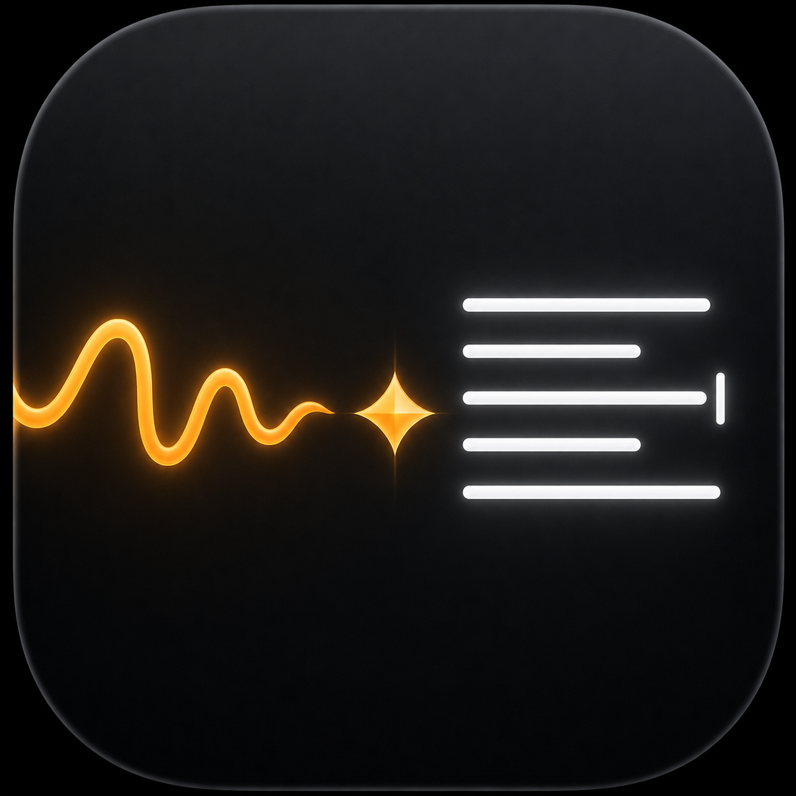

<div align="center">



# voxline

**Hold a key. Speak. Get polished writing.**

A native macOS dictation app that turns your voice into clean, written text — anywhere on your Mac. Speech runs on-device via Whisper. Cleanup runs through your own LLM API key, so you control the model, the cost, and the data path.

macOS 14.0+ · Apple Silicon · Bring your own API key


&nbsp;

&nbsp;

&nbsp;
[](https://github.com/tfredricks/voxline/actions/workflows/ci.yml)

</div>

> [!NOTE]
> voxline is in active development. Expect rough edges. The transcription pipeline is solid; the surface around it is still maturing.

## What it does

Most dictation tools dump a raw transcript with `um`, `uh`, half-finished sentences, and zero punctuation. voxline does the second step you actually want:

1. **Speech → text** locally on your Mac via Whisper.
2. **Text → polished writing** through a frontier LLM you choose (Claude or GPT).

Result: hold a hotkey, say what you mean — even messily — and watch clean prose appear in whatever field you're typing into.

## Features

- **Hold to talk** — press your hotkey, speak, release. Text appears in the focused field.
- **Works in any text field** — browser, email, IDE, terminal, Slack, Notes, Cursor, ChatGPT, anything that accepts a paste.
- **On-device transcription** — Whisper runs locally on Apple Neural Engine. Audio never leaves your Mac.
- **AI cleanup, not raw dump** — fillers, false starts, and rambling are smoothed out. Punctuation and capitalization are added automatically.
- **Context-aware per-app formatting** — voxline detects the frontmost app and tunes the output for it: terse Slack messages, structured email replies, code-comment style in your IDE, search-box one-liners. Ships with sensible defaults for 28 common apps out of the box.
- **Dictation history** — the last 10 cleaned dictations live in a menu-bar submenu; click any row to copy it back to the clipboard.
- **Bring your own LLM key** — Anthropic or OpenAI, your account, your model, your costs. Keys live in macOS Keychain.
- **Menu-bar native** — no Dock icon, no clutter. Configurable hotkey, mic, model, and provider.
- **Privacy-aware feedback** — clipboard is restored after paste; the system mic indicator turns off the moment you let go.

## How it works

```
                      ┌──────────────────┐
   🎙  microphone  →  │  Whisper (local) │  →  raw transcript
                      └──────────────────┘
                              │
                              ▼
                      ┌──────────────────┐
                      │  Claude or GPT   │  →  polished writing
                      └──────────────────┘
                              │
                              ▼
                       ⌨️  pasted into
                          the focused field
```

### Speech models (on-device)

| Model | Size | Best for |
|---|---|---|
| **Whisper large-v3 turbo** (default) | ~1.5 GB | Highest accuracy, multilingual |
| Whisper small.en | ~466 MB | Lightweight, English-only, fastest first run |

Models download on first use via [WhisperKit](https://github.com/argmaxinc/WhisperKit) and are cached locally. Switching models in Settings triggers an on-demand download — no app reinstall.

### Cleanup providers (cloud, your account)

| Provider | Default model | Where to get a key |
|---|---|---|
| **Anthropic** | claude-haiku-4-5 | https://console.anthropic.com/settings/keys |
| OpenAI | gpt-4.1-nano | https://platform.openai.com/api-keys |

Why cloud cleanup instead of a local model? Because the gap between a frontier LLM and what fits on a laptop is still enormous for prose quality. voxline's bet: trust on-device for the audio (which is sensitive), and let you pick best-in-class for the cleanup (which only sees a transcript). You decide which provider.

## Requirements

| | |
|---|---|
| **macOS** | 14 (Sonoma) or later |
| **Mac** | Apple Silicon — M1, M2, M3, M4, or any variant. Intel Macs are **not** supported. |
| **RAM** | 8 GB minimum, 16 GB recommended (the default `large-v3-turbo` model is happier with headroom) |
| **Disk** | ~2 GB free for speech models (`large-v3-turbo` ~1.5 GB, `small.en` ~466 MB). Models cache inside the app container. |
| **Network** | Required on first launch to download the Whisper model, and at runtime for AI cleanup. Pure transcription works offline once the model is cached. |
| **Microphone** | Any input device macOS recognizes (built-in mic is fine). |

Apple Silicon is non-negotiable: voxline runs Whisper on the Apple Neural Engine via WhisperKit, and there is no ANE on Intel Macs.

## Getting started

voxline doesn't ship a signed release yet. Build from source:

```bash
git clone https://github.com/tfredricks/voxline.git
cd voxline
open voxline.xcodeproj
```

Build and run from Xcode (⌘R). On first launch:

1. Grant **Microphone**, **Accessibility**, and **Input Monitoring** when prompted (the app will guide you).
2. Pick your hotkey, mic, and Whisper model in the Settings window (⌘,). The default hotkey is **Right Cmd + Right Option** — change it if you'd rather use something else.
3. Drop in an Anthropic or OpenAI API key in the **Cleanup (AI)** section.
4. Hold the hotkey anywhere on your Mac and start talking.

### Permissions

| Permission | Why |
|---|---|
| Microphone | Capture your voice while the hotkey is held. Audio never leaves your Mac. |
| Accessibility | Detect the global hotkey and paste into the focused field. |
| Input Monitoring | Required so the hotkey works when voxline isn't the frontmost app. |

## Privacy

What stays local:

- 🎙 **Audio capture** — held in memory only, never written to disk, dropped as soon as the transcript exists.
- 🧠 **Speech-to-text** — runs entirely on Apple Neural Engine via WhisperKit. No audio is sent anywhere.
- 🔑 **API keys** — stored in macOS Keychain. Not logged, not synced, not visible to other apps.

What goes to your LLM provider:

- ✍️ **The transcript only** — voxline sends a small text request to Anthropic or OpenAI for cleanup. Whatever provider's privacy policy applies (use enterprise tier or org-level keys if that matters to you).
- voxline has **no telemetry, no analytics, and no first-party server**. The only network traffic is to whichever LLM provider you choose and the Hugging Face model download on first use.

## Good to know

- **Sandboxed app** — voxline runs inside the macOS app sandbox, so model files live in the container, not your home folder.
- **Settings live in one place** — single-page Settings window with a status strip up top showing what's wired up. Switching providers keeps both keys around for fast toggling.
- **Resilient hotkey** — when permissions are revoked or restored, voxline reconciles automatically without a relaunch.
- **Open source** — read the code, audit the data path, file an issue, send a PR.

## Acknowledgments

Built on the shoulders of:

- [WhisperKit](https://github.com/argmaxinc/WhisperKit) — on-device Whisper inference for Apple Silicon
- [Whisper](https://github.com/openai/whisper) — the original model from OpenAI
- [swift-transformers](https://github.com/huggingface/swift-transformers) — model hub and inference utilities
- The macOS dictation tools that paved the way (Whispr Flow, Superwhisper, Ghost Pepper, and others) — voxline borrows the hold-to-talk UX they all converged on.

## Contributing

Bug reports, feature ideas, and pull requests are welcome. See [CONTRIBUTING.md](CONTRIBUTING.md) for build instructions, testing, and the DCO sign-off requirement.

## License

voxline is licensed under the [Apache License, Version 2.0](LICENSE).

See [NOTICE](NOTICE) and [THIRD-PARTY-NOTICES.md](THIRD-PARTY-NOTICES.md) for required attributions. The "voxline" name and logo are reserved — see [TRADEMARK.md](TRADEMARK.md).
