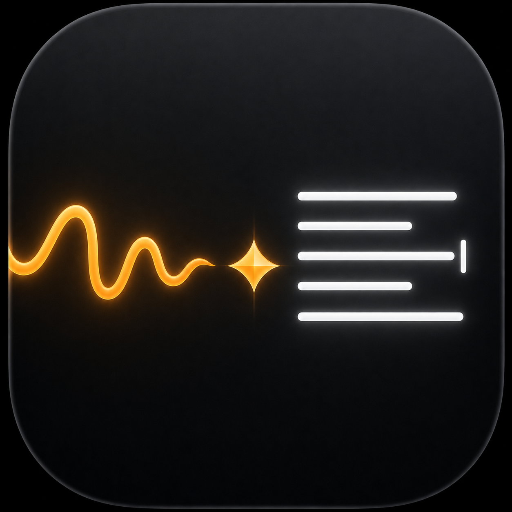

<div align="center">



# voxline

**Hold a key. Speak. Get polished writing.**

A native macOS dictation app that turns your voice into clean, written text — anywhere on your Mac. Speech runs on-device by default, via Apple Speech or Whisper. Cleanup runs through your own LLM API key, so you control the model, the cost, and the data path.

macOS 26+ · Apple Silicon · Bring your own API key


&nbsp;

&nbsp;

&nbsp;
[](https://github.com/tfredricks/voxline/actions/workflows/ci.yml)

</div>

> [!NOTE]
> voxline is in active development. Expect rough edges. The transcription pipeline is solid; the surface around it is still maturing.

## What it does

Most dictation tools dump a raw transcript with `um`, `uh`, half-finished sentences, and zero punctuation. voxline does the second step you actually want:

1. **Speech → text** locally on your Mac via Whisper or Apple Speech (or, if you opt in, OpenAI's cloud transcription).
2. **Text → polished writing** through a frontier LLM you choose (Claude or GPT).

Result: hold a hotkey, say what you mean — even messily — and watch clean prose appear in whatever field you're typing into.

## Features

- **Hold to talk** — press your hotkey, speak, release. Text appears in the focused field.
- **Works in any text field** — browser, email, IDE, terminal, Slack, Notes, Cursor, ChatGPT, anything that accepts a paste.
- **Edits land in place** — where an app supports it, voxline writes through Accessibility, so ⌘Z undoes a dictation or an edit in one step. Electron and Chromium apps, browsers, and terminals get a paste, and your clipboard is restored right after.
- **Your choice of speech engine** — Apple Speech (on-device, fastest, the default), Whisper (on-device), or OpenAI (cloud, opt-in). With the two on-device engines, audio never leaves your Mac.
- **Live transcript** — a small pill at the bottom of the screen shows your words as you speak, including over full-screen apps.
- **Esc to cancel, Retry to recover** — Esc throws away a dictation while it is recording or processing; if cleanup fails, Retry in the pill or the menu bar re-runs it on the same transcript.
- **AI cleanup, not raw dump** — fillers, false starts, and rambling are smoothed out. Punctuation and capitalization are added automatically.
- **Command mode: edit by voice** — hold the command chord (Left Shift + Left Option by default), say what to do, and let go. With text selected, the selection is replaced: *"make this a bullet list"*, *"translate this to Spanish"*, *"make this shorter"*. With nothing selected, the result goes in at the cursor (*"draft a short reply agreeing to the Thursday time"*), or, for an instruction about existing text (*"make the last paragraph shorter"*), only the part that changed is replaced. An edit is a normal ⌘Z-undoable change.
- **Preset edit shortcuts** — select text anywhere and press ⌥1, ⌥2, or ⌥3 to fix grammar, make it concise, or make it professional, with no recording. The shortcuts and their instructions are an editable table in Settings → Commands.
- **Context-aware per-app formatting** — voxline detects the frontmost app and tunes the output for it: terse Slack messages, structured email replies, code-comment style in your IDE, search-box one-liners. Ships with sensible defaults for 28 common apps out of the box.
- **Learns as you go** — fix a misheard name in the field after a dictation and voxline adds it to your custom vocabulary (with Undo in the pill), so it comes out right the next time. It also keeps a short note on how you write in chat, email, documents, and code, and uses it in cleanup. Read, edit, or reset what it learned in Settings → Vocabulary.
- **Dictation history** — the last 25 dictations, cleaned text and raw transcript side by side, in a History window; click any row to copy it back to the clipboard.
- **Bring your own LLM key** — Anthropic or OpenAI, your account, your model, your costs. Keys live in macOS Keychain.
- **Menu-bar native, with a real window when you want it** — a main window with Home (status, setup issues, permissions, recent meetings) and six settings pages; close it and voxline keeps running in the menu bar. No Dock icon unless the window is open, or turn on Settings → General → Show Voxline in Dock.
- **Meeting notes** — record a meeting of up to an hour (your mic plus your Mac's sound output), and get a Markdown file with a summary, decisions, action items, and a speaker-labeled transcript. Transcription and speaker separation run on your Mac; meetings use the Whisper small.en model (English) for speed.
- **Privacy-aware feedback** — clipboard is restored after paste; the system mic indicator turns off the moment you let go.

## How it works

```
┌──────────────── ON YOUR MAC ─────────────────┐
│  🎙 audio → Whisper / Apple Speech → text    │
│                                              │
│  Context block, assembled at press time:     │
│  • per-app mode prompt                       │
│  • focused-field AX (role, surroundings)     │
│  • custom vocabulary (canonical spellings)   │
└─────────────────────┬────────────────────────┘
                      │  transcript + context
                      ▼
┌────────── CLAUDE or GPT (your key) ──────────┐
│  strip fillers · fix self-corrections ·      │
│  match register · snap to vocab              │
└─────────────────────┬────────────────────────┘
                      │  polished writing
                      ▼
┌──────────────── ON YOUR MAC ─────────────────┐
│  insert into the focused field:              │
│  Accessibility write (⌘Z undoes it), else    │
│  paste (clipboard restored), else typing     │
└──────────────────────────────────────────────┘
```

### How text lands

voxline writes the result into the focused field through Accessibility where the app supports it, so ⌘Z undoes it in one step in native apps. Electron and Chromium apps, browsers, terminals, and any web content, where Accessibility writes are unreliable, get a paste instead, and apps with no accessible focus (some terminals, virtual machines, remote desktops) get a plain paste. A pasted result is handed to the app as it asks for it, and your clipboard is restored right after the app reads it (or after 1.5 seconds), and only if you haven't copied something else in the meantime. If nothing editable is focused, or the text can't be inserted, it is copied to the clipboard and the pill says so.

### Command mode

There are two chords: **dictation** (Left Shift + Left Control by default) and **command** (Left Shift + Left Option by default). Change either, or turn command mode off, in Settings → General → Hotkey. With ⇧⌥ as the command chord, typing a ⇧⌥ character such as an em dash briefly starts and discards a recording (you hear the start sound and see the microphone indicator), and a slowly pressed ⌥-digit preset can light the microphone indicator for a moment.

Hold the command chord, say what to do, and let go:

- **With text selected**, the selection is replaced: rewrite it, shorten it, translate it, reformat it, delete it.
- **With nothing selected**, the result is inserted at the cursor (draft a reply, continue writing, answer a question). If your instruction is about existing text, such as "make the last paragraph shorter", only the part of the field that changed is replaced, and the rest of the field, formatting included, is left alone.

Esc cancels a command while it is recording or thinking, as it does for dictation. Selections over 8,000 characters are refused ("Selection too long — 8,000 characters max"), and password fields are never read ("Command mode is off in password fields"). If an edit can't be applied in place, the result is copied instead and the pill says so ("Couldn't edit in place — copied, ⌘V to apply").

Commands use your cleanup model unless you set a **Command model** in Settings → Commands. A larger model drafts and answers better but responds more slowly.

### Preset shortcuts

Select text anywhere and press a shortcut: a stored instruction runs on the selection, with no recording.

| Shortcut | Preset | Instruction |
|---|---|---|
| ⌥1 | Fix grammar | Fix grammar, spelling, and punctuation. Change nothing else. |
| ⌥2 | Make concise | Make this more concise. Keep every fact and the original tone. |
| ⌥3 | Make professional | Rewrite this in a clear, professional tone. Keep the meaning and every fact. |

Settings → Commands holds the table: record a different shortcut, rename a preset, rewrite its instruction, add or remove rows, or restore the defaults. A shortcut must include ⌘, ⌥, or ⌃. Preset shortcuts are captured everywhere, even with nothing selected (you get "Select text to transform"), except while voxline itself is frontmost, so you can still type in its own fields. ⌥1, ⌥2, and ⌥3 normally type ¡, ™, and £, so remap them if you use those characters. A preset sends only the selection to your LLM provider, not the rest of the field.

### Speech engines

Pick one in Settings → Dictation → Engine.

| Engine | Runs | Best for |
|---|---|---|
| **Apple Speech** (default) | On your Mac | Fastest: the transcript is ready about 0.1 s after you let go, and there is no model to download if macOS already has the language. Won the bake-off on real recordings. |
| Whisper | On your Mac | Close on accuracy, but takes about half a second longer to finish. Needs a one-time model download (below). |
| OpenAI | OpenAI's servers | Cloud transcription (`gpt-4o-transcribe`) with your own OpenAI key. Audio leaves your Mac — see [Privacy](#privacy). Never the default. |

Switching engines prepares the new one in the background; if it needs a download, the menu bar shows progress and dictation waits. If OpenAI fails mid-dictation, voxline transcribes the same audio again on-device. Your custom vocabulary, including words voxline learned from your corrections, is applied during cleanup whichever engine you use; Apple Speech and OpenAI also use it as recognition hints. To measure the engines on your own voice, see [docs/bakeoff.md](docs/bakeoff.md).

### Whisper models (on-device)

| Model | Size | Best for |
|---|---|---|
| **Whisper large-v3 turbo** (default) | ~1.5 GB | Highest accuracy, multilingual |
| Whisper small.en | ~466 MB | Lightweight, English-only, fastest first run |

Models download on first use via [WhisperKit](https://github.com/argmaxinc/WhisperKit) and are cached locally. Switching models in Settings triggers an on-demand download — no app reinstall.

### Cleanup providers (cloud, your account)

| Provider | Default model | Where to get a key |
|---|---|---|
| **Anthropic** | claude-haiku-4-5 | https://console.anthropic.com/settings/keys |
| OpenAI | gpt-4.1-nano | https://platform.openai.com/api-keys |

Why cloud cleanup instead of a local model? Because the gap between a frontier LLM and what fits on a laptop is still enormous for prose quality. voxline's bet: trust on-device for the audio (which is sensitive), and let you pick best-in-class for the cleanup (which only sees a transcript). You decide which provider.

## Requirements

| | |
|---|---|
| **macOS** | 26 (Tahoe) or later |
| **Mac** | Apple Silicon — M1, M2, M3, M4, or any variant. Intel Macs are **not** supported. |
| **Speech engine** | One of three: Apple Speech (default) and Whisper run on-device; OpenAI is cloud and needs an OpenAI API key. |
| **RAM** | 8 GB minimum, 16 GB recommended (the default `large-v3-turbo` model is happier with headroom) |
| **Disk** | ~2 GB free if you use Whisper (`large-v3-turbo` ~1.5 GB, `small.en` ~466 MB). Models cache in `~/Library/Application Support/voxline`. Apple Speech needs none beyond macOS's own language assets. |
| **Network** | Required on first launch if macOS lacks Apple's language assets (or to download the Whisper model, if you choose Whisper), and at runtime for AI cleanup. Transcription with Whisper or Apple Speech works offline once the model is cached. The OpenAI engine needs a connection for every dictation. |
| **Microphone** | Any input device macOS recognizes (built-in mic is fine). |

Apple Silicon is non-negotiable: voxline runs Whisper on the Apple Neural Engine via WhisperKit, and there is no ANE on Intel Macs.

## Getting started

**Download a signed build** from [Releases](https://github.com/tfredricks/voxline/releases) — the DMG is notarized by Apple, and the app checks for updates automatically via Sparkle.

Or build from source:

```bash
git clone https://github.com/tfredricks/voxline.git
cd voxline
open voxline.xcodeproj
```

Build and run from Xcode (⌘R), or use `./scripts/build-local.sh` to build Release and install straight to `/Applications`.

On first launch:

1. Grant **Microphone** and **Accessibility** when prompted (the app will guide you).
2. Pick your hotkeys, mic, speech engine, and (for Whisper) model in the main window's Settings pages (open Voxline from the menu bar → Settings, or ⌘,): General for hotkeys and mic, Dictation for the speech engine and Whisper model. The default dictation hotkey is **Left Shift + Left Control** and the default command hotkey is **Left Shift + Left Option** — change either if you'd rather use something else.
3. Drop in an Anthropic or OpenAI API key on the **AI Provider** page.
4. Hold the dictation hotkey anywhere on your Mac and start talking. To edit text instead, select it, hold the command hotkey, and say what to change.

### Permissions

| Permission | Why |
|---|---|
| Microphone | Capture your voice while the hotkey is held. Audio stays on your Mac unless you select the OpenAI engine. |
| Accessibility | Detect the global hotkey, read the focused field, and edit it in place or paste into it. |

Input Monitoring is **not** required — Accessibility alone is enough for the global hotkey. macOS may still surface an Input Monitoring entry for voxline; you can leave it off (if macOS withholds key events from the hotkey listener, voxline falls back to watching modifier keys only). The Debug pane shows its status for diagnostics only.

## Privacy

What stays local:

- 🎙 **Audio capture** — held in memory only and dropped as soon as the transcript exists. It is not written to disk (the exceptions are meeting recordings and a hidden developer flag, below).
- 🧠 **Speech-to-text with Apple Speech or Whisper** — both run on your Mac (Whisper on the Apple Neural Engine via WhisperKit). With either engine, no audio is sent anywhere.
- 🔑 **API keys** — stored in macOS Keychain. Not logged, not synced, not visible to other apps.
- 📜 **History** — the last 25 dictations, including raw transcripts, are stored in the app's preferences on your Mac. Clear them any time from the History window. For a command or preset, History keeps the instruction (or preset name) and the text that was inserted, never the field's contents; a rewrite keeps only the changed part.
- 🧠 **Learning** — after each dictation, voxline reads the field through Accessibility, once a second for up to 30 seconds, to see whether you corrected the text. Password fields, terminals, VS Code, and Cursor are never read for this. A corrected name goes into your custom vocabulary. With style learning on, the last 20 dictations and up to 10 before-and-after corrections for each kind of app, and the style notes, are kept in `~/Library/Application Support/voxline/learning.json`. None of it is logged or added to History, and Clear History doesn't touch it. Turning a switch off in Settings → Vocabulary stops it but keeps what was learned until you choose Reset Learning, which deletes the data and the learned words. Text you type right after a dictation at the end of a field can be counted as part of it.
- ⌨️ **Key presses** — to tell your hotkey from OS shortcuts such as ⌘⇧4, the hotkey listener also notices that a non-modifier key went down, never which character. The listener for Esc and your preset shortcuts compares each key press only against those shortcuts and passes every other key through untouched.

- 🗓 **Meetings** — audio is recorded only after you choose Start Meeting Recording (or press your meeting shortcut), stays on this Mac, and is deleted after the retention period you pick (14 days by default). Transcription and speaker separation run on-device. The transcript and your custom vocabulary are sent to your LLM provider to write the notes, as dictation transcripts are. Many places require telling participants they're being recorded; Voxline doesn't announce anything into the call. Headphones give the cleanest call transcripts.

What goes to OpenAI, only if you select the OpenAI speech engine:

- 🎙 **Your audio** — it is streamed to OpenAI for transcription with your own OpenAI API key, and OpenAI's privacy policy applies. The Settings picker labels this engine "OpenAI — cloud, audio leaves your Mac", and it is never the default. While a cloud dictation is in progress, voxline also keeps that audio in memory so it can transcribe it on-device if the cloud fails; it is never written to disk.

What goes to your LLM provider:

- ✍️ **The transcript plus a small context slice** — voxline sends your transcript to Anthropic or OpenAI for cleanup, together with the frontmost app's name, the window title (up to 200 characters), the focused field's role, up to 500 characters of selected text, 200 characters before the cursor, 100 after it, and your custom vocabulary. Password fields never contribute their contents. Whatever provider's privacy policy applies (use enterprise tier or org-level keys if that matters to you).
- 🎨 **Your style note and two examples** — with style learning on, each cleanup also sends that kind of app's style note (up to 600 characters) and up to two of your recent dictations in the same app (up to 400 characters each). Every 20 dictations of a kind, voxline sends up to 20 recent dictations and 10 corrections of that kind plus the current note (about 14,600 characters at most) to write the note. Turn style learning off to send none of this.
- ✂️ **Command mode sends more of the field** — every command sends your spoken instruction, the app, window, and kind of field, your custom vocabulary, **the text of the focused field around the cursor or selection (up to 12,000 characters)**, and the selection (up to 8,000 characters) to your provider. A preset sends only the selection. Secure (password) fields are never read.

A hidden developer flag:

- 💾 **`voxline.debug.saveBakeoffClips`** — when switched on, voxline saves each dictation's audio (as a WAV) and cleaned text under `~/Library/Application Support/voxline/bakeoff`, to build recordings for the [engine bake-off](docs/bakeoff.md). It is the **only** thing in voxline that writes audio to disk. It has no entry in Settings and is **off by default**; the bake-off doc shows how to turn it off and delete the clips.

voxline has **no telemetry, no analytics, and no first-party server**. The only network traffic is to whichever LLM provider you choose, OpenAI if you select its speech engine, and the one-time model downloads (Hugging Face for Whisper; Apple's own language assets for Apple Speech, if macOS lacks them).

## Good to know

- **Not sandboxed, on purpose** — voxline reads the focused field through the Accessibility API, which the App Sandbox blocks. The app ships notarized with the hardened runtime, and its data lives in `~/Library/Application Support/voxline`.
- **Settings live in one place** — six pages in the main window's sidebar, with orange marks on pages that need setup and a Setup section on Home. Switching providers keeps both keys around for fast toggling.
- **Resilient hotkey** — when permissions are revoked or restored, voxline reconciles automatically without a relaunch. OS shortcuts that include your hotkey's keys, like ⌘⇧4, don't start a recording.
- **Open source** — read the code, audit the data path, file an issue, send a PR.

## Acknowledgments

Built on the shoulders of:

- [WhisperKit](https://github.com/argmaxinc/WhisperKit) — on-device Whisper inference for Apple Silicon
- [Whisper](https://github.com/openai/whisper) — the original model from OpenAI
- [swift-transformers](https://github.com/huggingface/swift-transformers) — model hub and inference utilities
- The macOS dictation tools that paved the way (Whispr Flow, Superwhisper, Ghost Pepper, and others) — voxline borrows the hold-to-talk UX they all converged on.

## Releasing

Maintainer notes — the steps to cut a tagged release.

**Versioning.** voxline uses [SemVer](https://semver.org/) for the marketing version (`CFBundleShortVersionString` — e.g. `0.2.1`). Bump it manually when cutting a release:

- **Patch** (`0.2.0` → `0.2.1`) — bugfixes only
- **Minor** (`0.2.0` → `0.3.0`) — new features, backwards-compatible
- **Major** (`0.x` → `1.0.0`) — first stable release, or breaking changes after that

The build number (`CFBundleVersion`) is the commit count on `main` and stamps itself at build time — never edit it by hand.

**Release checklist.**

1. Update `MARKETING_VERSION` in `voxline.xcodeproj/project.pbxproj` (one line).
2. In `CHANGELOG.md`, move `[Unreleased]` items under a new `[X.Y.Z] - YYYY-MM-DD` heading.
3. Commit: `chore: release vX.Y.Z`.
4. Tag and push:
   ```bash
   git tag vX.Y.Z
   git push origin main --tags
   ```
5. Create a GitHub Release from the tag; paste the CHANGELOG entry as the body.

That's the whole flow. Between releases, `MARKETING_VERSION` stays put — every dev build reports the last released version with a higher commit-count build number.

## Contributing

Bug reports, feature ideas, and pull requests are welcome. See
[CONTRIBUTING.md](CONTRIBUTING.md) for build instructions, testing, the DCO
sign-off requirement, and the [Code of Conduct](CODE_OF_CONDUCT.md).

## License

voxline is licensed under the [Apache License, Version 2.0](LICENSE).

See [NOTICE](NOTICE) and [THIRD-PARTY-NOTICES.md](THIRD-PARTY-NOTICES.md) for required attributions. The "voxline" name and logo are reserved — see [TRADEMARK.md](TRADEMARK.md).
